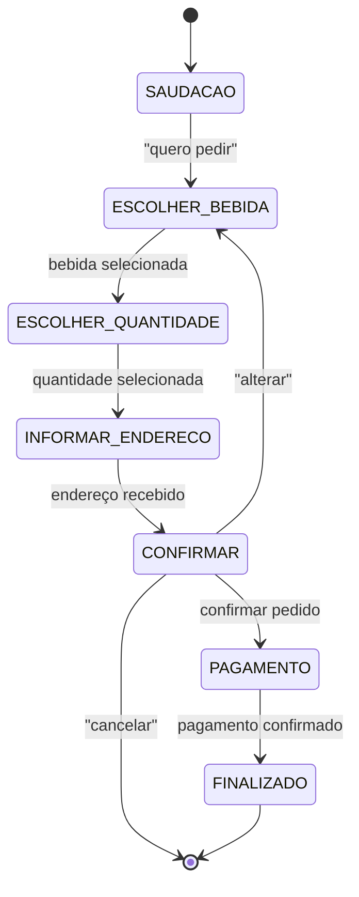

b# Chatbot SuperMario Drinks com Autômato Finito Determinístico (DFA)

## 1) Resumo do Tema
**Título:** Chatbot de Pedidos para Distribuidora de Bebidas com Autômato Finito Determinístico (DFA)  
**Objetivo:** Apresentar um fluxo de atendimento automatizado utilizando um DFA que conduz o cliente desde a saudação até a finalização do pedido.
O autômato organiza o processo em etapas como: seleção da bebida, escolha da quantidade, confirmação do pedido, coleta do endereço e conclusão.
Cada estado define uma ação específica, garantindo uma interação estruturada, clara e eficiente.

---

## 2) Diagrama de Estados (Mermaid)


---

## 3) Tabela de Estados e Transições

| Estado Atual        | Ação / Condição      | Próximo Estado      | Descrição               |
| ------------------- | -------------------- | ------------------- | ----------------------- |
| **(início)**        | —                    | **SAUDACAO**        | Entrada no fluxo        |
| SAUDACAO            | "quero pedir"        | ESCOLHER_BEBIDA     | Usuário inicia o pedido |
| ESCOLHER_BEBIDA     | bebida válida        | ESCOLHER_QUANTIDADE | Seleção da bebida       |
| ESCOLHER_QUANTIDADE | quantidade/embalagem | INFORMAR_ENDERECO   | Quantidade definida     |
| INFORMAR_ENDERECO   | endereço válido      | CONFIRMAR           | Coleta do endereço      |
| CONFIRMAR           | "confirmar"          | PAGAMENTO           | Confirmação             |
| CONFIRMAR           | "alterar"            | ESCOLHER_BEBIDA     | Recomeçar escolha       |
| CONFIRMAR           | "cancelar"           | **(fim)**           | Cancelamento            |
| PAGAMENTO           | pagamento definido   | FINALIZADO          | Finalização             |
| FINALIZADO          | —                    | **(fim)**           | Encerramento            |


---

## 4) Exemplo de Diálogo

**Bot:** Olá! Sou o assistente da Super Mario Drinks. Para iniciar seu pedido, digite "quero pedir"."
**Cliente:** quero pedir"
**Bot:** Ótimo! Qual bebida você deseja?"
Exemplos: Heineken, Budweiser, Skol, Brahma, Coca, Fanta, Pepsi, Guaraná, Monster, Whisky, Água."
Informe a bebida desejada."
Cliente: heineken"
**Bot:** Beleza! Heineken escolhida."
Agora, informe a quantidade e o tipo de embalagem (ex: lata, garrafa, long neck, caixa)."
**Cliente:** 3 caixas"
**Bot:** Perfeito!"
Agora me passe o endereço e um telefone para contato."
**Cliente:** Unialfa Perimetral 40028922"
**Bot:** Vamos confirmar seu pedido:"
Produto: Heineken"
Quantidade: 3 caixas"
Entrega: Unialfa Perimetral 40028922"
Digite “confirmar”, “alterar” ou “cancelar”."
Cliente: confirmar"
Bot: Como deseja pagar? Digite “dinheiro” ou “cartão”."
Cliente: cartão"
Bot: Pedido confirmado! 🎉"
Resumo final:"
* Produto: Heineken"
* Quantidade: 3 caixas"
* Endereço: Unialfa Perimetral 40028922"
* Pagamento: cartão"
Bot: Obrigado! A Super Mario Drinks agradece seu pedido."
Sua entrega chegará em aproximadamente 20 minutos."

---

## 5) Código em Java

```java
// ChatbotDistribuidora.java
import java.util.*;

public class ChatbotDistribuidora {

    private static final Scanner scanner = new Scanner(System.in);

    private static final List<String> BEBIDAS = Arrays.asList(
            "heineken","budweiser","skol","brahma",
            "coca","fanta","pepsi","guarana",
            "monster","whisky",
            "agua"
    );

    private static final List<String> QUANTIDADES = Arrays.asList(
            "lata","garrafa",
            "longneck","caixa"
    );

    private static String ask(String prompt) {
        System.out.println(prompt + "\n> ");
        return scanner.nextLine().trim().toLowerCase();
    }

    private static String extractKeyword(String text, List<String> options) {
        for (String opt : options) {
            if (text.contains(opt)) {
                return opt;
            }
        }
        return null;
    }

    public static void main(String[] args) {

        String state = "SAUDACAO";

        Map<String, String> pedido = new HashMap<>();
        pedido.put("produto", null);
        pedido.put("quantidade", null);
        pedido.put("endereco", null);
        pedido.put("pagamento", null);

        System.out.println("Bot: Olá! Sou o Bot da Super Mario Drinks. Diga 'quero pedir' para começar.");

        while (true) {

            switch (state) {

                case "SAUDACAO": {
                    String txt = ask("Você");
                    if (txt.matches(".(quero|pedir|comprar|bebida|pedido).")) {
                        state = "ESCOLHER_PRODUTO";
                        System.out.println("Bot: Qual bebida você deseja? Exemplos: Heineken, Budweiser, Skol, Brahma, Coca, Fanta, Pespsi, Guarana, Monster, Whisky, Agua");
                    } else {
                        System.out.println("Bot: Diga 'quero pedir' quando quiser iniciar um pedido.");
                    }
                    break;
                }

                case "ESCOLHER_PRODUTO": {
                    String txt = ask("Informe a bebida desejada");
                    String p = extractKeyword(txt, BEBIDAS);

                    if (p != null) {
                        pedido.put("produto", p);
                        state = "ESCOLHER_QUANTIDADE";
                        System.out.println("Bot: Certo, " + p.toUpperCase() + ". Insira a Quantidade e qual o tipo de embalagem. Ex: (lata, garrafa, longneck, caixa)");
                    } else {
                        System.out.println("Bot: Não temos essa bebida disponivel. Segue bebidas disponiveis: Heineken, Budweiser, Skol, Brahma, Coca, Fanta, Pespsi, Guarana, Monster, Whisky, Agua.");
                    }
                    break;
                }

                case "ESCOLHER_QUANTIDADE": {
                    String txt = ask("Quantidade");
                    String q = extractKeyword(txt, QUANTIDADES);

                    if (q != null) {
                        pedido.put("quantidade", txt);
                        state = "INFORMAR_ENDERECO";
                        System.out.println("Bot: Perfeito. Agora informe o endereço para entrega.");
                    } else {
                        System.out.println("Bot: Embalagens válidas: lata, garrafa, longneck, caixa.");
                    }
                    break;
                }

                case "INFORMAR_ENDERECO": {
                    String txt = ask("Endereço e telefone");

                    if (txt.length() > 5) {
                        pedido.put("endereco", txt);
                        state = "CONFIRMAR";
                    } else {
                        System.out.println("Bot: Informe um endereço válido (rua, número e telefone).");
                    }
                    break;
                }

                case "CONFIRMAR": {

                    String resumo = "Produto: " + pedido.get("produto") +
                            " | Quantidade: " + pedido.get("quantidade") +
                            " | Entrega: " + pedido.get("endereco");

                    System.out.println("Bot: Confirme o pedido:");
                    System.out.println("Bot: " + resumo);

                    String txt = ask("Digite 'confirmar', 'alterar' ou 'cancelar'");

                    if (txt.contains("confirm")) {
                        state = "PAGAMENTO";
                    } else if (txt.contains("alter")) {
                        state = "ESCOLHER_PRODUTO";
                        System.out.println("Bot: Vamos alterar. Qual bebida deseja?");
                    } else if (txt.contains("cancel")) {
                        System.out.println("Bot: Pedido cancelado. Obrigado!");
                        return;
                    } else {
                        System.out.println("Bot: Opções válidas: 'confirmar', 'alterar' ou 'cancelar'.");
                    }
                    break;
                }

                case "PAGAMENTO": {
                    String txt = ask("Como deseja pagar? 'dinheiro' ou 'cartão'");

                    if (txt.contains("din")) {
                        pedido.put("pagamento", "dinheiro");
                        state = "FINALIZADO";
                    } else if (txt.contains("cart")) {
                        pedido.put("pagamento", "cartão");
                        state = "FINALIZADO";
                    } else {
                        System.out.println("Bot: Escolha 'dinheiro' ou 'cartão'.");
                    }
                    break;
                }

                case "FINALIZADO": {
                    System.out.println("\nBot: Pedido confirmado! 🎉");
                    System.out.println("Resumo final:");
                    System.out.println(pedido);
                    System.out.println("Bot: Obrigado a Super Mario Drinks agradeçe seu pedido! Sua entrega chegará em aproximadamente 20 minutos.");
                    return;
                }
            }
        }
    }
}
```

---
